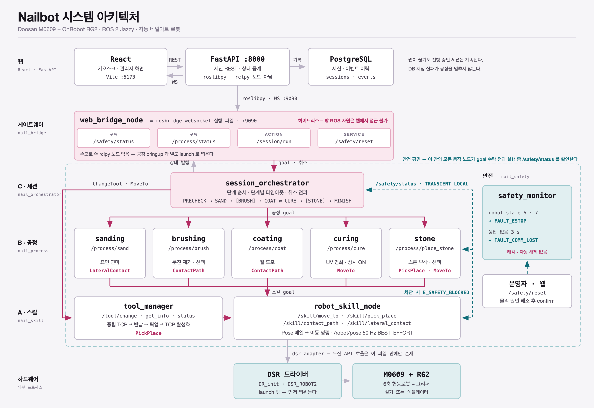
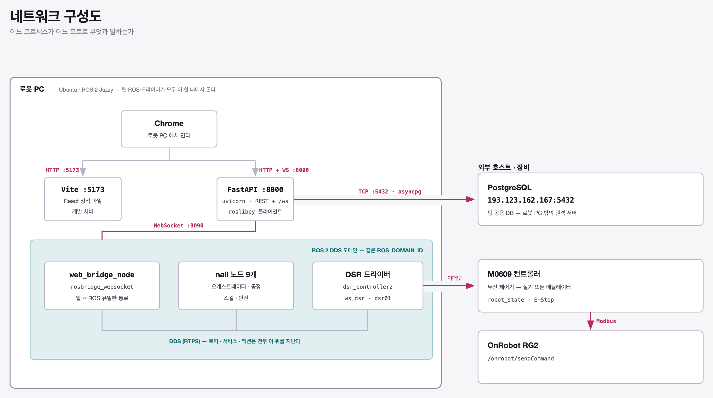
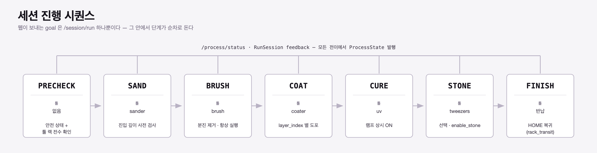
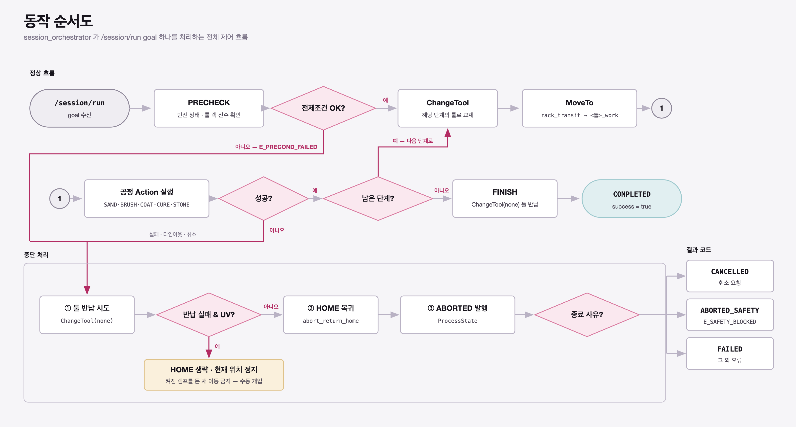
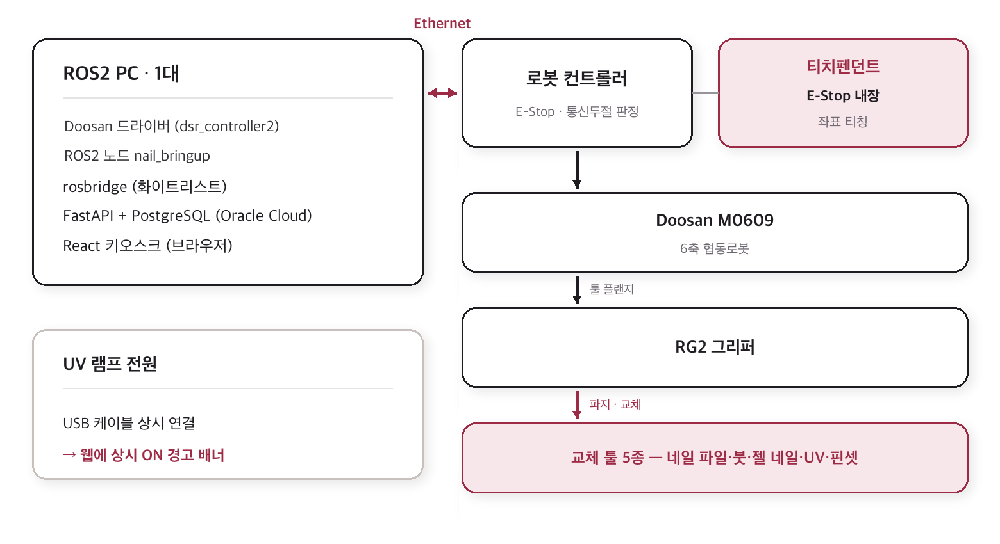
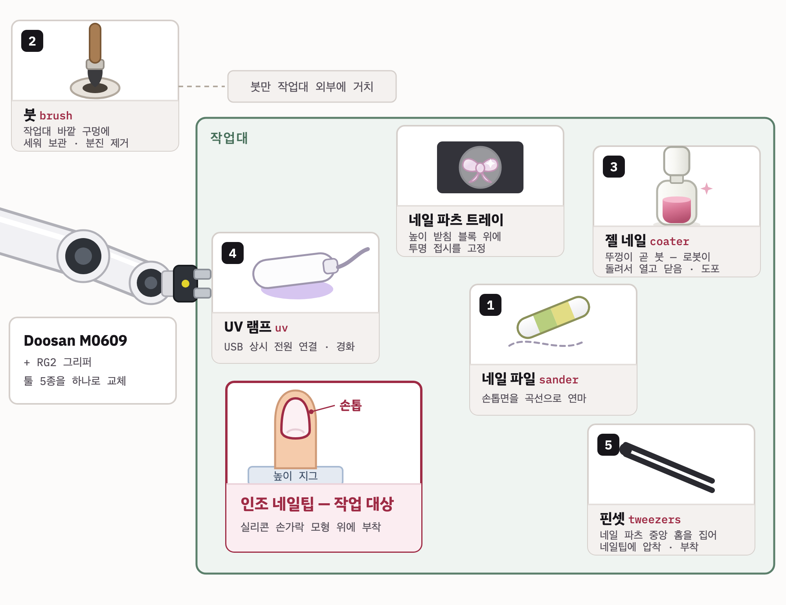

# Nailbot — 자동 네일아트 로봇 시스템

Doosan M0609 기반 자동 네일아트 로봇

---

## 1. 시스템 설계



### 1.1 통신 인터페이스

```text
Topic     /process/status (ProcessState) · /safety/status (SafetyState)
          /tool/status (ToolState) · /robot/pose (PoseStamped, 50 Hz)
Service   /safety/validate · /safety/reset · /tool/get_info
Action    /session/run
          /process/{sand, brush, coat, cure, place_stone}
          /skill/{move_to, pick_place, contact_path, lateral_contact} · /tool/change
```

### 1.2 네트워크 구성



웹·ROS 노드·DSR 드라이버가 **로봇 PC 한 대**에서 전부 돈다.

---

## 2. 플로우 차트

### 2.1 세션 진행 시퀀스



```text
PRECHECK → SAND → BRUSH → COAT → CURE → [STONE] → FINISH
```

- 각 단계 앞에 `TOOL_CHANGE`가 들어간다.

### 2.2 동작 순서도



---

## 3. 운영체제 환경

| 항목 | 값 |
|---|---|
| OS | Ubuntu 24.04 LTS|
| ROS 배포판 | ROS 2 Jazzy |
| Python | 3.12 |
| 빌드 | colcon |
| Node.js | 18+ (Vite 6 / TypeScript 5.6) |
| 컨테이너 | Docker Compose (PostgreSQL 16-alpine) |

### 워크스페이스 배치

이 저장소는 **DSR 드라이버와 별도의 워크스페이스**다.  
두 워크스페이스를 overlay로 함께 source 해야 한다. (`ws_dsr`를 먼저 source)

```text
~/ws_cobot_pjt/
├── ws_dsr/        # 두산 dsr_bringup2 · dsr_common2 · dsr_msgs2 · onrobot 드라이버
└── ws_cobot1/     # 이 저장소 (src/nail_*)
```

---

## 4. 사용한 장비 목록



### 4.1 로봇 · 제어

| 장비 | 모델 | 비고 |
|---|---|---|
| 협동로봇 | Doosan M0609 (6축) | 이더넷으로 로봇 PC와 연결 |
| 그리퍼 | OnRobot RG2 | Modbus, `/onrobot/sendCommand` |
| 티치펜던트 | 두산 순정 | **E-Stop 내장** — 별도 비상정지 박스 없음 |
| 로봇 PC | Ubuntu · ROS 2 Jazzy | 웹·ROS·드라이버 동시 구동 |

### 4.2 툴 · 작업물



---

## 5. 의존성

### 5.1 ROS 2 (rosdep)

각 패키지 `package.xml`에 선언돼 있다. 한 번에 설치하려면:

```bash
cd ~/ws_cobot_pjt/ws_cobot1
rosdep install --from-paths src --ignore-src -r -y
```

| 패키지 | 주요 의존 |
|---|---|
| `nail_msgs` | `rosidl_default_generators`, `std_msgs`, `geometry_msgs`, `builtin_interfaces` |
| `nail_skill` | `rclpy`, `tf2_ros`, `tf2_geometry_msgs`, `onrobot_rg_msgs`, `nail_perception` |
| `nail_process` | `rclpy`, `nail_skill`, `nail_perception`, `python3-yaml` |
| `nail_safety` / `nail_orchestrator` | `rclpy`, `nail_msgs`, `std_msgs` |
| `nail_bridge` | `rosbridge_server`, `python3-yaml` |
| `nail_bringup` | `launch`, `launch_ros`, `tf2_ros`, `python3-yaml` |

외부 워크스페이스(`ws_dsr`)에서 오는 의존: `dsr_common2`(`DSR_ROBOT2`),
`dsr_msgs2`, `dsr_bringup2`, `onrobot_rg_msgs`.

### 5.2 백엔드 — `web/backend/requirements.txt`

```text
fastapi==0.115.6          uvicorn[standard]==0.34.0
sqlalchemy==2.0.36        asyncpg==0.30.0
greenlet==3.5.5           pydantic==2.10.4
pydantic-settings==2.7.0  roslibpy==2.1.0
PyYAML==6.0.2
```

> FastAPI는 rclpy 노드가 아니라 **`roslibpy` 클라이언트**로 rosbridge에 붙는다.
> 백엔드에 ROS 2 설치가 필요 없는 이유다.

### 5.3 프론트엔드 — `web/frontend/package.json`

```text
react 18.3 · react-dom 18.3
vite 6.0 · typescript 5.6 · @vitejs/plugin-react 4.3
```

---

## 6. 실행 순서

터미널마다 아래 환경을 먼저 적용한다. **순서가 중요하다.**

```bash
source /opt/ros/jazzy/setup.bash
source ~/ws_cobot_pjt/ws_dsr/install/setup.bash
source ~/ws_cobot_pjt/ws_cobot1/install/setup.bash
```

### 0. 빌드 (최초 1회 · 인터페이스 변경 시)

```bash
cd ~/ws_cobot_pjt/ws_cobot1
colcon build --packages-select nail_msgs nail_perception nail_skill \
  nail_process nail_orchestrator nail_safety nail_bridge nail_bringup
source install/setup.bash
```

설정 YAML(`targets.yaml`, `tool_rack.yaml`, `taught_*.yaml`,
`static_frames.yaml`)을 고친 뒤에도 **재빌드 + 노드 재시작**이 필요하다.

### 1. 두산 드라이버 — 터미널 A

이 저장소의 launch는 드라이버를 켜지 않는다. 실기 또는 에뮬레이터에 맞는
`dsr_bringup2`(+ OnRobot 그리퍼 드라이버)를 **먼저** 띄운다.

```bash
# ws_dsr 쪽 launch — 실제 파일명·인자는 사용 중인 dsr_bringup2 버전에 맞춘다
ros2 launch dsr_bringup2 dsr_bringup2.launch.py \
  mode:=real  name:=dsr01  model:=m0609  host:=<로봇 컨트롤러 IP>  # 에뮬레이터는 mode:=virtual (host 생략 시 기본 127.0.0.1)
```

- `name`(= `dsr_prefix`)은 이후 launch 인자와 동일해야 한다 (기본 `dsr01`).
- `mode:=real`일 때는 `host:=`(컨트롤러 IP)를 반드시 지정한다. 생략하면 기본값
  `127.0.0.1`로 붙으려다 연결이 실패한다. 컨트롤러 포트가 기본(`12345`)과
  다르면 `port:=`도 같이 넘긴다.
- 노드가 뜬 것과 액션이 실제로 도는 것은 다르다 — 드라이버가 없어도 `nail_*`
  노드는 기동되지만(서비스 디스커버리 타임아웃 WARN만 출력), `MoveTo`·
  `PickPlace`를 쏘면 두산 서비스 응답을 무한 대기한다.

### 2. ROS 2 공정 스택 — 터미널 B

```bash
ros2 launch nail_bringup integration_bringup.launch.py
```

`frames` + 안전 + 스킬 + 툴 + 공정 5종 + 오케스트레이터를 전부 띄운다.
주요 인자:

| 인자 | 기본값 | 설명 |
|---|---|---|
| `dsr_prefix` | `dsr01` | 두산 드라이버 네임스페이스 |
| `home_target_key` | `rack_transit` | 실패·취소 시 복귀할 티칭 경유점 |
| `sanding_path_y_offset_mm` | `0.5` | 샌딩 3-Pose 전체 Y 보정 |
| `log_level` | `info` | `debug`로 주면 상세 로그 |

<details>
<summary>노드 단위로 골라 띄우기 (단위 테스트용)</summary>

```bash
# 기본: safety + skill + tool
ros2 launch nail_bringup test_bringup.launch.py

# 연마 노드만 추가 — 공정 노드는 frames 를 반드시 같이 넣을 것
ros2 launch nail_bringup test_bringup.launch.py nodes:=frames,safety,skill,tool,sanding
```

토큰: `frames` `safety` `skill` `tool` `sanding` `brushing` `coating`
`curing` `stone` `orchestrator` (또는 `all`).
**의존 노드를 자동으로 끼워 넣지 않는다** — 무엇이 켜져 있는지 항상 명시적으로
보이게 하려는 설계다.
</details>

### 3. ROS ↔ 웹 게이트웨이 — 터미널 C

```bash
ros2 launch nail_bridge web_bridge.launch.py
```

`ws://localhost:9090`에 화이트리스트가 적용된 rosbridge가 뜬다.

### 4. PostgreSQL — 터미널 D

```bash
cd web && docker compose up -d db
```

팀 공용 원격 DB를 쓰면 이 단계를 건너뛰고 `.env`의 `DATABASE_URL`만 바꾼다.

### 5. 백엔드 — 터미널 E

```bash
cd web/backend
cp .env.example .env          # 최초 1회, DATABASE_URL·ROSBRIDGE_* 확인
pip install -r requirements.txt
uvicorn app.main:app --reload --port 8000
```

### 6. 프론트엔드 — 터미널 F

```bash
cd web/frontend
npm install
npm run dev
```

| 화면 | 주소 |
|---|---|
| 고객 키오스크 | http://localhost:5173 |
| 관리자 대시보드 | http://localhost:5173/admin |
| 백엔드 헬스체크 | http://localhost:8000/api/health |

### 실행 순서 요약

```text
① dsr_bringup2 (드라이버)  →  ② integration_bringup (ROS 공정 스택)
   →  ③ web_bridge (rosbridge)  →  ④ docker compose db
   →  ⑤ uvicorn (FastAPI)  →  ⑥ npm run dev (React)
```